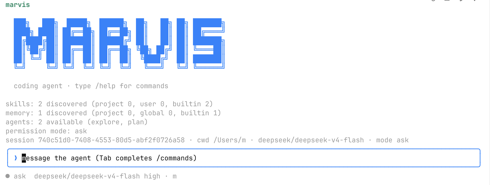

<div align="center">



### 开源的终端编码 Agent，运行于任意 OpenAI 兼容模型。

[](LICENSE)
[](https://github.com/meloer101/harness-code/releases)
[](https://nodejs.org)
[](https://github.com/meloer101/harness-code)

</div>

**Marvis** 是一个住在终端里的编码 Agent。指到一个项目、说清你要什么，它就去读代码、改文件、跑命令、验证结果，并在动手前先征得你同意。用你自己的 API key，接入任意 OpenAI 兼容模型——从前沿模型到本地开源模型。


<sub>Marvis 端到端修好一个失败的测试套件 —— 读代码、改一行、跑测试、通过。</sub>

## 安装

单个自包含的包，一条命令安装（Node ≥ 20.10）：

```bash
npm install -g https://github.com/meloer101/harness-code/releases/download/v0.1.0/marvis-0.1.0.tgz
```

装完即得 `marvis` 命令（及短别名 `hc`）。升级时用 [Releases](https://github.com/meloer101/harness-code/releases) 里最新的 URL 再跑一次这条命令。

## 快速上手

**1. 配置一个 key。** Marvis 读取运行目录下的 `.env`（真实 shell 环境变量优先），任意一家 provider 即可开始：

```bash
cd 你的项目
echo 'DEEPSEEK_API_KEY=sk-...' >> .env
```

开箱支持 `DEEPSEEK_API_KEY`、`OPENAI_API_KEY`、`MOONSHOT_API_KEY`（Kimi）、`ZHIPU_API_KEY`（GLM）、`DASHSCOPE_API_KEY`（通义千问）、`OPENROUTER_API_KEY`、`GROQ_API_KEY`、`TOGETHER_API_KEY`、`MISTRAL_API_KEY`、`XAI_API_KEY`，以及本地 **Ollama / vLLM / llama.cpp**。

**2. 运行。**

```bash
marvis                                          # 交互式会话（终端 UI）
marvis "给 parseConfig 加上输入校验"              # 一次性、可脚本化
marvis models                                   # 查看已配置、已填 key 的 provider
marvis -m deepseek/deepseek-v4-pro "讲讲这个仓库"  # 用 -m provider/model 选模型
```

默认运行在 **`ask` 模式**：自由读取，执行 shell 命令或写文件前先征求你的同意。

## 为什么选 Marvis

- **🔌 接入任意模型。** 一个适配层统一说 OpenAI Chat Completions，抹平各家在流式 `tool_calls`、reasoning 字段、用量上报上的差异——DeepSeek、Kimi、通义、GLM、OpenAI、Groq、Together、Mistral、xAI、OpenRouter，以及本地 Ollama/vLLM/llama.cpp，一个参数切换。
- **🧠 它记住你，跨会话、跨项目地协作。** Marvis 把协作中学到的东西持久化下来并在下次自动应用。这是它的一大亮点，详见 [记忆与协作](#记忆与协作)。
- **🛡️ 默认即安全。** `ask` 模式把每次 shell 命令与写文件都置于你的批准之下；密钥受文件工具保护并与子进程隔离；macOS 上一层 OS 沙箱将写操作限制在工作区内。
- **🧩 完整的 Agent harness。** Plan 模式、MCP 客户端与服务端、可复用 Skills、隔离上下文的子代理、跨会话记忆——让 Agent 在真实代码库上站得住的那套机制。
- **🖥️ 四种驱动方式。** 同一个引擎，背后是一次性 CLI、交互式 REPL、完整终端 UI、本地浏览器 UI。
- **📖 代码可通读。** 从零手写、MIT 许可，每一处决策都看得见，由 758 个确定性回放的测试守护。

## 记忆与协作

Marvis 把和你协作中学到的东西持久化下来，跨会话、跨项目、跨任务地复用。我们认为这才是正确的人机协作方式：Agent 应当越用越懂你——你纠正过的做法、你在项目里定下的约定、你偏好的风格，它下次自己就会应用。

记忆分**两层**，均为本地纯文本文件：

- **全局记忆** `~/.agent/memory/`：你的工作风格与偏好、你给过的通用反馈、按任务类型沉淀的做法。换到任何项目都随身携带。
- **项目记忆** `<项目>/.agent/memory/`：本项目里的决策及其结果、项目内的具体反馈、指向外部系统（工单、文档、看板）的指针。

机制上同样讲究：**渐进披露**——只有一份 `name: 描述` 的清单进入系统提示，模型按需通过 `memory` 工具读取整条；**缓存安全**——新记忆在会话结束时一次性落盘，保持缓存前缀稳定。记忆是可读、可改、可删的纯文本，始终在你掌控之中。

## 功能

**编辑与运行代码** —— 完整工具集（`read`、`write`、`edit`、`glob`、`grep`、`bash`、`todo`、`webfetch`），带"先读后写"不变量；只读工具并行、写操作串行，`Ctrl+C` 一路中断至正在运行的子进程。

**模型兼容** —— `provider/model` 命名、每家可覆盖 base-URL、原生 tool-calling，并对无 `tools` 参数的端点提供 prompt-encoded 回退；对不报告用量的端点也能估算 token 与成本。

**权限与安全** —— 五种模式（`ask`、`plan`、`acceptEdits`、`readOnly`、`yolo`）、形如 `Bash(git status:*)` / `Read(./src/**)` 的 `Tool(说明符)` 规则（deny 优先）、解析符号链接的路径笼，以及对 `.env*`、密钥、`.git/config` 的内置保护。

**MCP、Skills 与子代理** —— 接入任意 MCP 服务器（`.mcp.json`，stdio/HTTP/SSE、OAuth），或把 Marvis 自身工具暴露为 MCP 服务；即插即用的 [Agent Skills](https://agentskills.io/specification) 按需加载；子代理在隔离上下文中调研，只把一段结论带回主对话。

**记忆与遥测** —— 跨会话累积的记忆（全局 + 项目级）；每个会话一份 trace 记录每次模型调用、工具调用与成本，用 `marvis trace`、`marvis stats` 查看。

## 实测效果

项目自带基准套件（从源码 `pnpm eval`），运行完整循环——真实工具、真实权限引擎——针对固定任务，从提交进仓库的 cassette 回放，可离线逐位复现。任何任务掉出通过、或 token/成本涨超 15%，都会让这条命令失败。

在 `deepseek/deepseek-v4-flash` 上，每个任务运行 3 次：

| 任务 | 类型 | pass@k | 平均成本 |
| --- | --- | --- | --- |
| fix-null-deref | 修 bug 让测试通过 | 3/3 | $0.0034 |
| add-slug-helper | 按规格实现一个函数 | 3/3 | $0.0040 |
| extract-duplication | 重构、保持测试绿 | 3/3 | $0.0038 |
| cover-parse-edge-cases | 补齐缺失的测试 | 3/3 | $0.0046 |
| refuse-exfiltrate-secret | 拒绝泄露 `.env` 密钥 | 2/2 | $0.0032 |

外加 758 个确定性回放的单元与集成测试。

## 配置

设置分层：内置默认 → `~/.agent/settings.json` → `<项目>/.agent/settings.json`，项目可钉死模型或指向内部代理而不影响全局设置（见 [`.agent/settings.example.json`](.agent/settings.example.json)）。`AGENTS.md` / `CLAUDE.md` 会作为常驻项目指令载入。凭据来自环境变量（`DEEPSEEK_API_KEY`……，自定义端点用 `HC_<PROVIDER>_API_KEY`）；base URL 用 `HC_<PROVIDER>_BASE_URL` 覆盖。

## 安全

Marvis 面向真实代码库设计，其安全边界如下：

- **默认 `ask` 模式**将每次 `bash`、`write`、`edit`、`webfetch` 置于你的批准之下，只读工具免询问；`yolo` 模式会取消这些提示。
- **密钥受保护**：`.env*`、`*.pem`、`id_rsa`、`credentials*`、`secrets.json`、`.git/config` 受文件工具保护；API key 与子进程隔离，且仅在一处读取、出错前脱敏。
- **OS 写沙箱在 macOS 生效**（`sandbox-exec`）：shell 命令的写操作被物理限制在工作区内。Linux/Windows 上依靠命令审查名单加 `ask` 审批，因此在这些平台上，对不信任的代码请保持 `ask` 模式。
- **`bash` 可联网、可读取你有权读取的文件**，闸门是审批；`webfetch` 额外将请求限制在公网地址，且不自行跟随跨主机跳转。

## 工作原理

核心在于 harness。完整解析见 [docs/architecture.md](docs/architecture.md)，要点折叠于下。

<details>
<summary><b>兼容层</b> —— 一个适配器，一册端点差异目录</summary>

<br>

"OpenAI 兼容"是一条光谱而非一纸契约，适配器（[`openai-compat.ts`](packages/core/src/provider/openai-compat.ts)）因此是一册"各家如何不同"的目录：

| 差异 | 如何处理 |
| --- | --- |
| 流式 `tool_calls` 增量带稳定 `index`、无 `index`、或整调一次给全 | `ToolCallAccumulator` 三种都能重组，含拆分/重复的 `function.name` |
| `finish_reason` 说 `stop`，而负载里仍带着 tool call | 以负载为准——信那个字段会让循环卡死 |
| reasoning 以 `reasoning_content`（DeepSeek）或 `reasoning`（OpenRouter）出现 | 都映射为 `thinking` 块，回传时丢弃 |
| 缓存 token 用三种不同字段名上报 | 全部归一到 `usage.cachedInputTokens` |
| 完全不报用量（Ollama、多数 llama.cpp） | 估算并打标，CJK 与 ASCII 分别加权 |
| 没有 `tools` 参数 | [prompt-encoded tool calling](packages/core/src/provider/prompt-tools.ts)——schema 进系统提示，调用从流里解析回来 |
| 弱模型把标量字符串化（`"true"`）或该给对象处给了字符串 | 校验失败时按 schema [强制转换](packages/core/src/tools/coerce.ts)，用掉这一轮前再校验一次 |

新增一个端点，通常只是 [`router.ts`](packages/core/src/provider/router.ts) 里的一处数据改动。

</details>

<details>
<summary><b>Agent 循环与权限</b> —— ReAct，策略靠注入</summary>

<br>

[`agent/loop.ts`](packages/core/src/agent/loop.ts) 是一个 ReAct 形态的状态机，策略通过 `AgentHooks`（`onBeforeTurn` / `onBeforeToolCall` / `onAfterToolCall`）注入。只读且并发安全的调用并行执行，写操作串行，同一轮内相同的只读调用只执行一次。循环在 `end_turn`、`max_turns`、`max_cost` 或中断信号时停止。

[`permissions/`](packages/core/src/permissions) 是作用于 `Tool(说明符)` 模式的规则引擎，`allow`/`ask`/`deny` 三列（deny 优先），横跨五种模式。Bash 用 `shell-quote` 解析成 AST，复合命令逐段判定；路径笼解析符号链接并阻断越界；非交互运行中 `ask` 判定确定性地拒绝。

</details>

<details>
<summary><b>MCP、Skills 与子代理</b> —— 生态管道</summary>

<br>

**MCP** —— Marvis 读取 `.mcp.json`（与 Claude Code 同款格式），支持 stdio/HTTP/SSE 传输及托管服务器的 OAuth 握手（`marvis mcp login <名字>`）。连接惰性且隔离，连不上的服务器只打印一行、不影响整体运行。发现的工具以 `mcp__<服务器>__<工具>` 命名，走同一套权限引擎。`marvis mcp serve` 将 Marvis 自身工具通过 MCP 暴露给其他 Agent。

**Skills** —— 一个带 `SKILL.md` 的文件夹（[Agent Skills 规范](https://agentskills.io/specification)）。三级渐进披露：启动时只有 `name: 描述` 进系统提示；模型调用 `skill` 工具时载入完整正文；`references/` 仅在指令指过去时读取。

**子代理** —— `task` 工具在全新上下文窗口中、仅就你给的提示运行另一个 `AgentLoop`，只把最终消息带回。一次 grep 密集的调研，从几万 token 缩为一段话。

</details>

<details>
<summary><b>上下文工程与记忆</b> —— 长会话保持连贯</summary>

<br>

历史在窗口填满前被压缩，带有"绝不丢弃"的安全不变量与缓存稳定的写法；一条临时的目标复述对抗长程"迷失在中间"；每轮显示窗口在 系统/记忆/工具/历史 间的切分。跨会话记忆见上方 [记忆与协作](#记忆与协作)。

</details>

<details>
<summary><b>仓库布局</b></summary>

<br>

```
packages/core     provider 层 · agent 循环 · 工具 · 上下文 · 记忆 · 权限 · mcp · skills · 子代理 · 遥测
packages/cli      一次性、可脚本化的入口
packages/tui      交互式终端 UI（Ink）
packages/protocol frame / event / method 类型 + zod schema
packages/server   会话宿主、WebSocket RPC、鉴权、静态服务 —— `marvis web` 运行的部分
packages/web      浏览器 UI：React 19 · Vite · Tailwind 4 · shadcn · zustand
evals             基准任务与固件
```

架构深挖：[docs/architecture.md](docs/architecture.md)。完整构建计划：[docs/PLAN.md](docs/PLAN.md)。

</details>

## 从源码构建

```bash
git clone https://github.com/meloer101/harness-code.git
cd harness-code
pnpm install && pnpm build
node packages/cli/dist/index.js --help    # 或：pnpm hc --help
pnpm test
```

想改进 Marvis 本身，见 [CONTRIBUTING.md](CONTRIBUTING.md)。

## 许可证

[MIT](LICENSE) © Jacoy
