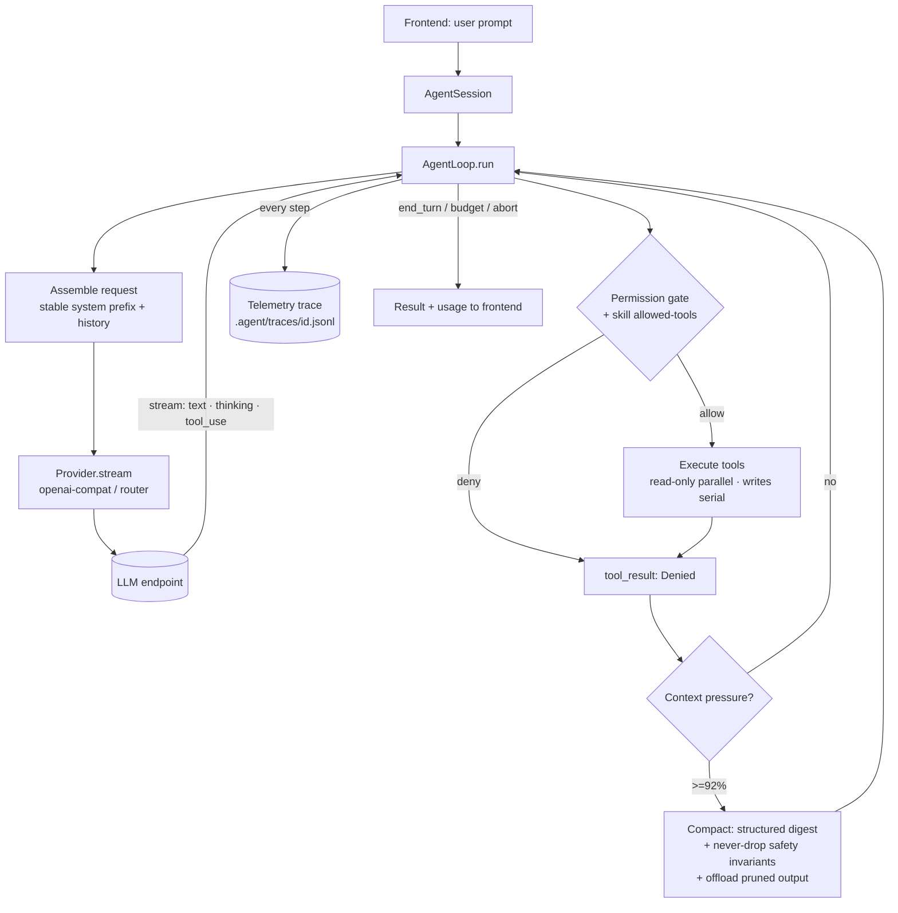

# Architecture

How `harness-code` (`hc`) is put together, and why. This is the narrative
companion to the feature-by-feature [README](../README.md): it traces one turn
end to end, names the module that owns each job, and explains the four *harness*
concerns the project is really about — context engineering, permissions &
sandboxing, sub-agents, and observability & evaluation.

The thesis: wrapping an LLM in a `while` loop is an afternoon's work; everything
that makes that loop *useful and safe* on a real codebase lives in the layers
around it. This repo is those layers, written to be read.

---

## Package topology

A pnpm workspace. Dependencies point inward — `core` knows nothing about any
frontend; the frontends and the server depend on `core`; `protocol` is a
leaf of pure types shared by the web boundary.

```
                 ┌───────────────────────────────────────────────┐
   frontends     │  cli (one-shot + REPL)      tui (Ink)          │
                 │  server ── ws ── web (React)                   │
                 └───────────────────────┬───────────────────────┘
                                         │ drive
                         ┌───────────────▼───────────────┐
   the engine            │          @harness-code/core    │
                         │  AgentSession · AgentLoop      │
                         │  provider · tools · context ·  │
                         │  memory · permissions · mcp ·  │
                         │  skills · subagents · telemetry│
                         └───────────────┬───────────────┘
                                         │ types only
                              ┌──────────▼──────────┐
   shared boundary           │  @harness-code/protocol  (no node deps) │
                             └─────────────────────────────────────────┘
```

| Package | Role |
| --- | --- |
| `packages/core` | The whole engine — everything below. The only package with the agent logic. |
| `packages/cli` | `hc` binary: one-shot (`hc "…"`, scriptable) and a readline REPL. |
| `packages/tui` | Interactive terminal UI (Ink) — streaming markdown, tool cards, modals, slash commands. |
| `packages/server` | Session host: `node:http` + a single `/ws` WebSocket carrying RPC and the event stream, origin/token auth, static serving. What `hc web` runs. |
| `packages/web` | Browser UI (React 19 · Vite · Tailwind 4 · shadcn · zustand) over the server. |
| `packages/protocol` | Frame / event / method types + zod schemas + the shared event-fold logic. No node deps, so both server and browser import it. |
| `evals` | Benchmark tasks, fixtures, cassettes, the runner, and the ablation harness. |

All four frontends are thin: they translate user input into calls on one
`AgentSession` and render the `AgentEvent` stream it emits. The loop has no idea
which one is driving it.

---

## The normalized core: provider layer

`packages/core/src/provider/` exists so the rest of the system speaks exactly one
message shape — `Message { role, content: ContentBlock[] }` where a block is
`text | tool_use | tool_result | thinking`, plus a normalized `Usage` and a
`StreamEvent` union. Providers translate to and from that; nothing above the
provider layer ever sees an endpoint's raw wire format.

- **`openai-compat.ts`** — one adapter over OpenAI Chat Completions, the de-facto
  lingua franca (DeepSeek, Kimi, Qwen, Zhipu, OpenRouter, Groq, Together, Mistral,
  xAI, LiteLLM proxies, Ollama, vLLM, llama.cpp). It is mostly a catalogue of the
  ways "OpenAI-compatible" endpoints disagree: streamed `tool_calls` delta
  reassembly, `finish_reason` that lies while tool calls sit in the payload,
  `reasoning_content` vs `reasoning`, three different cached-token field names,
  endpoints that report no usage at all.
- **`router.ts`** — LiteLLM-style `provider/model` parsing and per-provider
  base-URL / key resolution. Adding an endpoint is normally a data change here.
- **`capabilities.ts`** — per-model capability bits (native tools, parallel tool
  calls, prompt cache, context window, pricing, `allowedToolsChoice`). The loop
  reads these to decide what it may ask the endpoint to do.
- **`prompt-tools.ts`** — the degrade path: when an endpoint has no `tools`
  parameter, tool schemas are rendered into the system prompt and calls are parsed
  back out of the token stream (tolerant of truncation, code fences, Python
  literals), so a tool-less local model runs the identical loop.
- **`mock.ts`** — a record/replay provider. A live run is captured to a cassette;
  tests and `pnpm eval` replay it deterministically, with symmetric workspace-path
  rewriting so a cassette replays on any machine.

---

## The agent loop and its hooks

`packages/core/src/agent/loop.ts` is a ReAct-shaped state machine:

> assemble request → stream the model → collect `tool_use` → permission gate →
> execute (read-only in parallel, writes serial) → append `tool_result` → repeat

until `end_turn`, a turn/token/cost budget, or an aborted `AbortSignal` (Ctrl+C
propagates all the way into a running `bash` child). **Policy is kept out of the
loop and injected through hooks** rather than `if` branches:

| Hook | Consumers |
| --- | --- |
| `onBeforeTurn` | goal-restatement & budget nudges |
| `onBeforeToolCall` | permission engine, plan mode, skill `allowed-tools` gate |
| `onAfterToolCall` | telemetry, read-before-write ledger |
| `onContextPressure` / `onCompact` | compaction, tool-output pruning/offload |

Because every cross-cutting concern is a hook consumer, the same loop serves
one-shot, REPL, TUI, and web unchanged, and a sub-agent is just another
`AgentLoop` with a narrower tool set and a fresh state.

`AgentSession` (`agent/session*.ts`, `control.ts`) wraps the loop as the façade
the frontends drive: it owns `SessionState` (including the read-before-write
ledger), session persistence to `.agent/sessions/<id>.jsonl` (for `--resume`),
the activated-skill set, and flushes buffered memory writes at `close()`.

### One turn, end to end



---

## Pillar 1 — Context engineering

`packages/core/src/context/` keeps the window productive over a long session.

- **`compactor.ts`** — past a window fraction (default 92%) the oldest turns are
  summarized by a cheap model into a *structured* digest (task state, decisions,
  files touched, open questions, snippets); the first user message is kept
  verbatim. A **never-drop safety pass** extracts user prohibitions and
  denied-permission boundaries from history and re-injects any the summarizer
  dropped — compaction cannot silently lose a "don't touch X" or a refused scope.
  The same module prunes bulky `tool_result` bodies and **offloads** them to
  `.agent/sessions/<id>/toolout-*.txt`, leaving a placeholder that points `read`
  at the file (reversible; a write failure falls back to a re-call stub).
- **`tokenizer.ts`** — heuristic token counting with an **EMA calibrator** that
  regresses the heuristic against each turn's real `usage`, so budget math tracks
  the endpoint rather than a fixed ratio (CJK weighted apart from ASCII).
- **`cache.ts`** — enforces a fixed system-prefix order (system → skills manifest
  → memory → project instructions → history) so automatic prefix caching keeps
  hitting; hit rate is reported per turn.
- **`budget.ts`** — per-category accounting (system / memory / tools / history),
  surfaced each turn.
- **`memory.ts`** — loads `AGENTS.md` / `CLAUDE.md` from project root down to cwd
  (plus `~/.agent/`) as standing instructions.

The design invariant throughout: **don't move the cached prefix.** Mid-session
skill loading constrains tool *choice* (not the schema array), goal nudges are
*ephemeral*, and memory writes are buffered to `close()` — each a deliberate
choice to preserve KV-cache hits.

### Cross-session memory

`packages/core/src/memory/` is the capability a bare loop lacks: memory that
survives across sessions. Two tiers — `~/.agent/memory/` (global: user profile,
working-style feedback, per-task-type notes) and `<project>/.agent/memory/`
(decisions/outcomes, project feedback, external pointers) — disclosed the same
way skills are: an `<available_memory>` manifest in the prompt, full entries read
on demand via the `memory` tool. `buffer.ts` batches writes and `store.ts` flushes
them once at session close. No semantic retrieval, dedup/merge, or sync — by
choice; the reasoning is in [ROADMAP.md](./ROADMAP.md).

---

## Pillar 2 — Permissions & sandbox

`packages/core/src/permissions/` is a rule engine over `Tool(specifier)` patterns
(`Bash(git status:*)`, `Read(./src/**)`, `mcp__github__create_issue`) with
`allow` / `ask` / `deny` lists (deny always wins), layered user → project, across
five modes: `ask`, `plan`, `acceptEdits`, `readOnly`, `yolo`.

- **Bash via AST.** Commands are parsed with `shell-quote` into an AST, not
  regex-matched; compound commands (`&&`, `|`, `;`, subshells) are judged segment
  by segment, and a command-substitution prefilter hard-denies `$(…)`. Inline eval
  flags for `node`/`python`/`perl`/`ruby` are unconditionally denied (they escape
  any `Bash(node:*)` allowance).
- **Path cage.** Paths are `realpath`-resolved and must stay inside the workspace
  (blocks symlink and `../` escape); a denylist blocks `.env*`, `.git/config`,
  private keys, credentials.
- **OS sandbox.** On macOS a `sandbox-exec` profile confines child processes to
  workspace writes — the layer that catches what textual review misses (e.g. a
  legitimate tool doing `echo x > /outside`).
- **Non-interactive safety.** With no one to answer, an `ask` verdict
  deterministically *denies* rather than hanging — the precondition for scripting.

MCP tools ride this same engine (they can't self-report side effects, so they
default to the `bash` tier: serial, non-read-only, asked).

---

## Pillar 3 — Sub-agents & parallelism

`packages/core/src/subagents/` dispatches isolated work. The `task` tool runs a
named agent (`.agent/agents/*.md`, `~/.agent/agents/`, or builtins `explore` /
`plan`) as its own `AgentLoop` on a **fresh context window**; only its final
message returns to the caller. A grep-heavy investigation that would push tens of
thousands of tokens of match output into the main conversation instead costs it
one paragraph (measured: parent history stayed 4.1k while the sub-agent spent 3.1k
searching).

Invariants: a sub-agent's permissions only *narrow* (parent rules + mode, never a
rule added; tool set filtered to the def's `tools`); `task` is never in a
sub-agent's tools (no recursion); several `task` calls in one turn run
concurrently under the loop's concurrency cap; each is turn-budgeted and its usage
folds into the session total. The sub-agent's system prompt shares the parent's
`identity` + `conventions` byte-for-byte, so it hits the same cached prefix.

---

## Pillar 4 — Observability & evaluation

**Telemetry** (`packages/core/src/telemetry/`) appends a structured trace to
`.agent/traces/<id>.jsonl` — one event per model call (tokens / cache / latency /
cost), tool call (input summary, duration, output bytes, `denied` flag),
compaction, sub-agent rollup, provider error, and run outcome. It is a *separate*
file from the session log: the session log stays messages-only for `--resume`,
the trace carries volatile numbers that `hc trace` / `hc stats` read without
touching it. Tool output bodies never enter the trace (byte count only) — copying
multi-megabyte dumps here is a mistake that has bitten before.

**Evaluation** (`evals/`) runs the *whole* loop — real tools, real permission
engine, real compaction — against fixture tasks (each a self-contained project
with a prompt and an `assert.mjs`). The model is served from a committed cassette,
so CI reruns identically with no network; a task that stops passing, or a >15%
rise in tokens/cost vs `baseline.json`, fails the command. `--record` re-records
against a live endpoint; **`--ablation <compaction|subagents|prompt-tools>`** runs
the suite twice (two live arms whose differing request shape can't replay) and
prints the comparison the README's ablation tables come from.

> Note on the baseline: live `--record` numbers come from the endpoint's real
> `usage`, while replay numbers are heuristic-estimated (the EMA calibrator only
> corrects on live runs). Since CI gates on replay, `baseline.json` is kept
> replay-derived (`--update-baseline`) so the gate is self-consistent.

---

## Runtime layout (`.agent/`)

Everything a run produces or reads lives under `.agent/`, aligned with Claude
Code's shapes so ecosystem MCP servers and skills drop in unchanged:

```
.agent/
  settings.json        model / provider / capability overrides (layered under ~/.agent/)
  .mcp.json            MCP servers (stdio / http / sse), ${ENV} interpolation
  agents/*.md          sub-agent definitions
  skills/**/SKILL.md   project skills (progressive disclosure)
  memory/              project-scoped cross-session memory
  plans/<slug>.md      plan-mode output
  sessions/<id>.jsonl  resumable conversation log (+ <id>/toolout-*.txt offloads)
  traces/<id>.jsonl    telemetry
```

Settings layer built-in defaults → `~/.agent/settings.json` →
`.agent/settings.json`. Credentials come only from the environment
(`DEEPSEEK_API_KEY`, `HC_<PROVIDER>_API_KEY`, …), read in one place and redacted
before any error prints.

---

## Where to start reading

- The loop and its hooks: [`packages/core/src/agent/loop.ts`](../packages/core/src/agent/loop.ts)
- Endpoint normalization: [`packages/core/src/provider/openai-compat.ts`](../packages/core/src/provider/openai-compat.ts)
- Compaction + safety invariants: [`packages/core/src/context/compactor.ts`](../packages/core/src/context/compactor.ts)
- The permission engine: [`packages/core/src/permissions/`](../packages/core/src/permissions)
- The eval/ablation harness: [`evals/src/cli.ts`](../evals/src/cli.ts)
